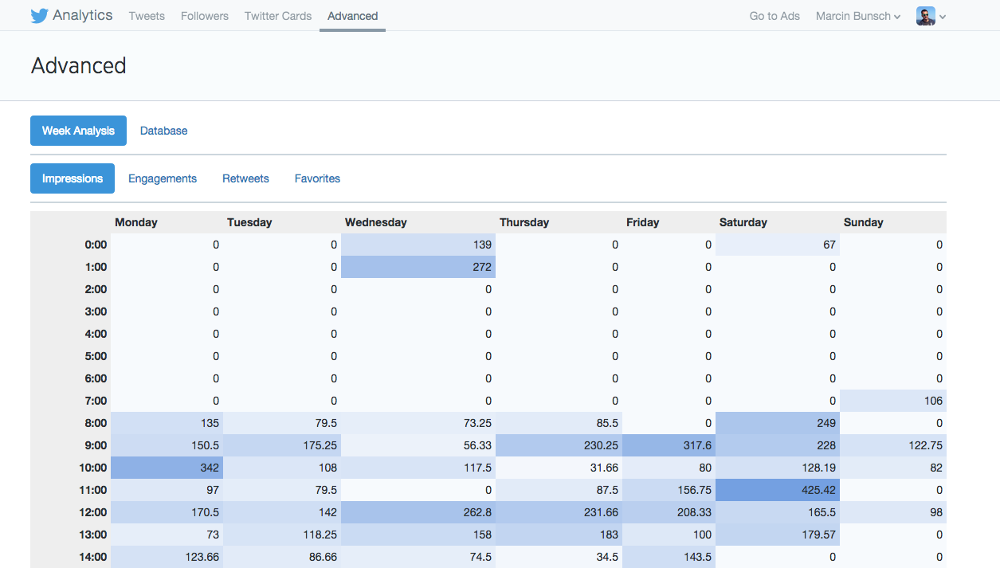

# Twitter Advanced Analytics

This is a Chrome extension which adds an Advanced tab to Twitter Analytics.

It currently does the following:

* It downloads and export of data and stores it in IndexedDB
* It lists all tweets
* It gives a week report, which shows average impressions/engagements/retweets/favorites for tweets at specific time and day of the week.
* It allows ignoring specific tweets in advanced reports

It's super hacky right now, so use at your own risk.

##Copyright

License is MIT, see LICENSE for details.

